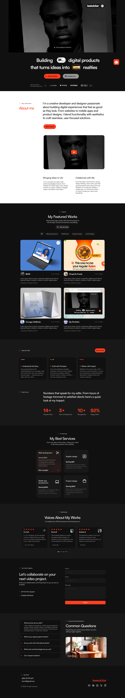
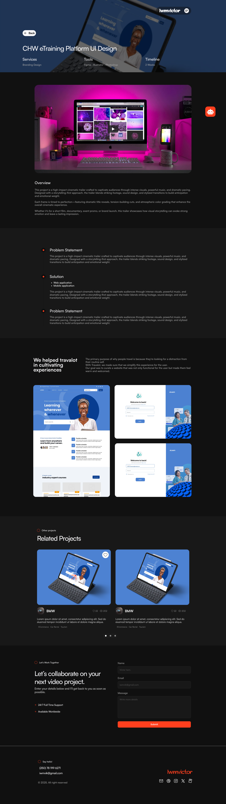
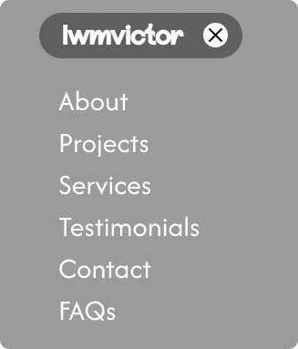

# iwmvictor – Personal Portfolio

This is the source code for my personal creative portfolio website. Designed and built from scratch using HTML, CSS, and JavaScript, the site showcases my featured projects, design process, and contact channels.

## Figma Design

Full prototype available on Figma:  
[View Design](https://www.figma.com/proto/EEtnhpc6dIZxDAodVRrsog/portfolio?node-id=29-3&t=saPFr09KJT1mcifP-1)

## Directory Structure

```
portfolio/
├── index.html
├── project.html
├── README.md
│
├── /assets/
│ └── /images/
│ └── /ui/
│ ├── homepage.png
│ ├── menu.png
│ ├── project.png
│ └── chatbot.png
│
├── /components/
├── /css/
│ ├── main.css
│ └── reset.css
├── /js/
│ ├── main.js
│ └── chat.js
```

## Features

- Responsive, minimal dark-themed layout
- Chat-based inquiry UI
- Modular HTML components
- Optimized for accessibility (ARIA)
- SEO-friendly structure and metadata

## Tools Used

- HTML5, CSS3, JavaScript (Vanilla)
- Figma (UI/UX Design)
- Google Fonts, Font Awesome

## UI Screenshots

``2 Pages``
### Homepage



### Project Page



``Modal Components``

### Menu



### Chat Interface


## Contact

You can connect or follow my work on the following platforms:

- [Dribbble](https://dribbble.com/iwmvictor)
- [Pinterest](https://pinterest.com/iwmvictor)
- [Behance](https://behance.net/iwmvictor)

For collaboration or inquiries:  
[Chat on WhatsApp](https://wa.me/250781990271)

## License

This project is personal. Feel free to explore the code for learning or inspiration. For commercial use or collaborations, please contact me directly.
<br/>[Learn more](/LICENSE.md)